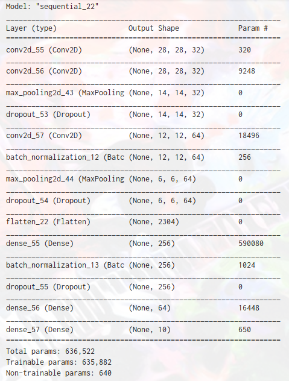

## Implementation of the model

We tried many different model implementations. We started out with a dense neural network and scored around 70% accuracy. Then we upgraded to a convolution neural network and experimented with a many different architectures. This meant testing out 1-4 convolutions layers, 2-3 dense layers, and 1-5 dropout layers in an attempt to prevent overfitting. The total parameters of these models varied from ~70,000 to ~950,000.

## Results 

Our first submission scored a 84%. We found that models with more parameters tended to perform better as long as there were enough dropout layers to prevent overfitting. We were aiming for a model that took 25 or fewer epochs to train, so if it went 25 epochs without the training accuracy pulling away from the validation accuracy, we weakened the dropout layers. Eventually we found a best model that included three convolutional layers, two dense layers, two pooling layers, two batch normalization layers, and three dropout layers for a total of 635,882 trainable parameters!. This model's summary is displayed on the following page.

## Challenges

This is more of a superficial challenge, but a challenge none the less: not taking advantage of GPU acceleration. Too much time was spent waiting for models to train that could have been spent optimizing them. On the positive side, eventually I did find out about GPU acceleration, and will get into the habitat of activating it every time I open Google Collab.

I was challenged by my disuse of a plan when hyperparameter training. In hindsight, I should have taken a more systematic approach instead of randomly changing hyperparameters and hoping for improvements in results. In reality this makes no sense because with my current level of understanding of convolutional neural networks, the chance of the model improving its performance after one of my tweeks is probably close to 50%. Writing a program to test a variety of different architectures and hyperparameters and letting it run over night is what I should have done. But at least I will value this strategy more highly next time.

## Conclusion

Overall, this Kaggle was a fantastic learning experience. I got to make many mistakes and will learn from them as best as I can.
My takeaways include that I should spend more time researching the goal before blinding coding an implementation, make sure that I am taking advantage of all possible resources (looking at you GPU acceleration), and that I should develop a systematic approach to solving problems rather than a spontaneous one. Also, it is so satifying when an "improvement" actually works!

## Individual Contributions

Cole Killian:

> I wrote the code for automating the downloading, unzipping and loading into memory of the data files, as well as for saving the submission to a csv (although this was adapted by code shared by Rick in the Slack).
 
> I built the keras model architectures and performed hyperparameter tuning manually. That being said, I was heavily influenced by the following very helpful articles and the starter code from Slack:
 
> 1. [https://mlexplained.com](https://mlexplained.com/2018/01/10/an-intuitive-explanation-of-why-batch-normalization-really-works-normalization-in-deep-learning-part-1/)
> 2. [https://towardsdatascience.com](https://towardsdatascience.com/a-guide-to-an-efficient-way-to-build-neural-network-architectures-part-ii-hyper-parameter-42efca01e5d7)
> 3. [https://www.youtube.com/watch?v=lOZGYzTn9Z8](https://www.youtube.com/watch?v=lOZGYzTn9Z8)
> 4. [https://www.kaggle.com/pavansanagapati/a-tutorial-cnn-model-fashion-mnist](https://www.kaggle.com/pavansanagapati/a-tutorial-cnn-model-fashion-mnist)

## Link to Github Repository:

\url{https://github.com/Ruborcalor/CNN_NMIST}
